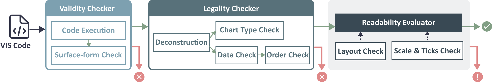

# VisEval: A NL2VIS Benchmark
VisEval is a benchmark designed to evaluate visualization generation methods. 
In this repository, we provide both the toolkit to support the benchmarking, as well as the data used for benchmarks.

## What Can VisEval Evaluate



VisEval evaluates generated visualizations from three dimensions: 
1. Whether the generated code can produce the visualization.
2. Whether the generated visualization meets the query.
3. Whether the generated visualization is easy to read.


## Get Started
### Install Benchmark Toolkit

```bash
pip install --upgrade vis-evaluator
# or `git clone https://github.com/microsoft/VisEval.git && cd VisEval && pip install --upgrade -e .`
```

### Download Benchmark Dataset
To access the dataset, please follow these steps:

1. Download the dataset from [this link](https://github.com/microsoft/VisEval/blob/main/viseval_dataset.zip).
2. Once the download is complete, unzip the file to extract the dataset contents.

For additional information about the dataset, please refer to the [dataset documentation](docs/data.md).

### Usage & Examples
After installation, you can use VisEval by referring to `examples/evaluate.py` or a follow:


1. **Create your generation method** by inheriting from the `Agent` Class. You can find three examples in the `examples/agent` directory.
```python
from viseval.agent import Agent, ChartExecutionResult

class YourAgent(Agent):
    def __init__(self, llm):
        self.llm = llm
    
    def generate(
        self, nl_query: str, tables: list[str], config: dict
    ) -> Tuple[str, dict]:
        """Generate code for the given natural language query."""
        pass

    def execute(
        self, code: str, context: dict, log_name: str = None
    ) -> ChartExecutionResult:
        """Execute the given code with context and return the result"""
        pass
```

2. **Configure evaluator**.
```python
    evaluator = Evaluator(webdriver_path, vision_model)
```
(You can configure the Evaluator without a webdriver and vision model, in which case the evaluation of the readability of the generated visualizations will be skipped.)

- Install webdriver.
    ```bash
    # download
    wget https://dl.google.com/linux/direct/google-chrome-stable_current_amd64.deb
    # install
    apt install google-chrome-stable_current_amd64.deb
    # verify
    google-chrome --version
    ```

- Load vision model (e.g., GPT4-v).
    ```python
    from langchain_openai import AzureChatOpenAI

    import dotenv
    # Copy .env.example to .env and put your API keys in the file.
    dotenv.load_dotenv()

    vision_model = AzureChatOpenAI(
        model_name="gpt-4-turbo-v",
        max_retries=999,
        temperature=0.0,
        request_timeout=20,
        max_tokens=4096,
    )
    ```
    
3. **Evaluate**
```python
from viseval import Dataset

# Configure dataset with the benchmark dataset folder path ( folder), 
# specify the number of tables required to generate visualizations (table_type`: all, single, or multiple),
# and indicate whether to include irrelevant tables (`with_irrelevant_tables`).
dataset = Dataset(folder, table_type, with_irrelevant_tables)

config = {"library": args.library}
result = evaluator.evaluate(agent, dataset, config)
score = result.score()
print(f"Score: {score}")
```


## Contributing

This project welcomes contributions and suggestions.  Most contributions require you to agree to a Contributor License Agreement (CLA) declaring that you have the right to, and actually do, grant us the rights to use your contribution. For details, visit https://cla.opensource.microsoft.com.

When you submit a pull request, a CLA bot will automatically determine whether you need to provide a CLA and decorate the PR appropriately (e.g., status check, comment). Simply follow the instructions provided by the bot. You will only need to do this once across all repos using our CLA.

This project has adopted the [Microsoft Open Source Code of Conduct](https://opensource.microsoft.com/codeofconduct/).For more information see the [Code of Conduct FAQ](https://opensource.microsoft.com/codeofconduct/faq/) or contact [opencode@microsoft.com](mailto:opencode@microsoft.com) with any additional questions or comments.

## Trademarks

This project may contain trademarks or logos for projects, products, or services. Authorized use of Microsoft trademarks or logos is subject to and must follow
[Microsoft's Trademark & Brand Guidelines](https://www.microsoft.com/en-us/legal/intellectualproperty/trademarks/usage/general).
Use of Microsoft trademarks or logos in modified versions of this project must not cause confusion or imply Microsoft sponsorship.
Any use of third-party trademarks or logos are subject to those third-party's policies.

## Privacy Statement

This project has adopted the [Microsoft Privacy Statement](https://go.microsoft.com/fwlink/?LinkId=521839.).

## Citation

If you find that VisEval helps your research, please consider citing it:
```
@misc{chen2024viseval,
      title={VisEval: A Benchmark for Data Visualization in the Era of Large Language Models}, 
      author={Nan Chen and Yuge Zhang and Jiahang Xu and Kan Ren and Yuqing Yang},
      year={2024},
      eprint={2407.00981},
      archivePrefix={arXiv},
      primaryClass={cs.HC},
}
```
